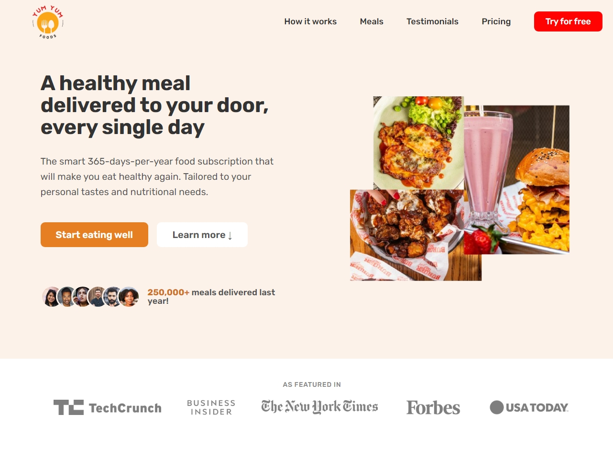
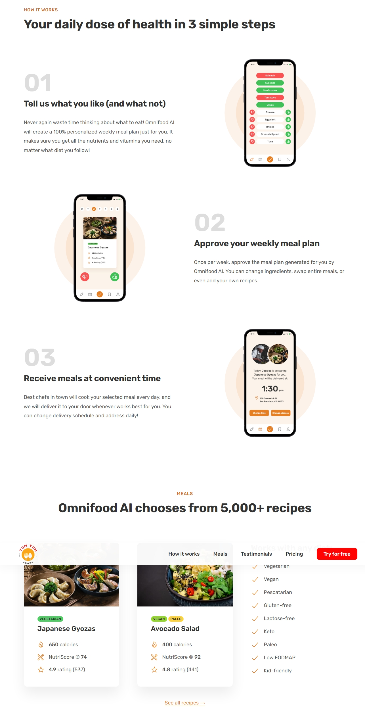
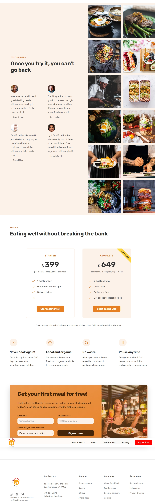

# yumyum-meals
"🍽️ Yum Yum Meals – AI-powered food subscription service delivering healthy, personalized meals. Built with HTML, CSS, and JavaScript, with a future Node.js backend. 🚀 #AI #FoodDelivery #MealPlanner"
# 🍽️ Yum Yum Foods - AI-Powered Food Subscription
 
 
 
## 📌 Table of Contents
- [Overview](#overview)
- [Features](#features)
- [Technologies Used](#technologies-used)
- [Installation](#installation)
- [Usage](#usage)
- [File Structure](#file-structure)
- [Icons & Fonts](#icons--fonts)
- [Contributing](#contributing)
- [License](#license)

## 🌟 Overview
**Yum Yum Foods** is an AI-powered food subscription service that provides healthy meals tailored to your personal tastes and nutritional needs. This website is designed using **HTML**, **CSS**, and **JavaScript**, with plans to be completed using **Node.js** for backend functionality.

⚠️ **Project Status:** Work in progress 🚧. Backend development with **Node.js** is currently underway.

## 🚀 Features
✅ Fully responsive and modern design  
✅ Smooth scrolling navigation  
✅ Sticky header for easy access  
✅ Mobile navigation toggle  
✅ Dynamic testimonials and pricing sections  
✅ Integration with Google Fonts and Ionicons  

## 🛠️ Technologies Used
-  **HTML5** - Markup structure
-  **CSS3** - Styling and layout design
-  **JavaScript (ES6+)** - Interactivity and dynamic elements
-  **Node.js (Upcoming)** - Backend development
- **Ionicons** - Icons
- **Google Fonts** - Rubik font for better typography
- **Slick Carousel** - Smooth image carousel
- **jQuery** - Simplifies DOM manipulation
  

## 🏗️ Installation
1. Clone the repository:
   ```sh
   git clone https://github.com/Kishan-shr/yumyum-meals
   ```
2. Navigate to the project folder:
   ```sh
   cd yumyumfoods
   ```
3. Open `index.html` in your preferred browser.

## 🎯 Usage
Simply open `index.html` in your browser. The website is fully functional without a backend, but **Node.js integration** is coming soon!

## 📂 File Structure
```
/yumyumfoods
│── index.html       # Main HTML file
│── css/
│   ├── general.css  # General styling
│   ├── style.css    # Main stylesheet
│   ├── queries.css  # Media queries for responsiveness
│── js/
│   ├── script.js    # JavaScript for interactivity
│── img/             # Image assets
│── manifest.webmanifest # Web app manifest
```

## 🎨 Icons & Fonts
- **Ionicons** are used for navigation and meal attributes.
- **Rubik Font** is used for a modern and clean look.
- Icons are loaded from: `https://unpkg.com/ionicons@5.4.0/dist/ionicons.js`

## 🤝 Contributing
Contributions are welcome! If you'd like to contribute:
1. Fork the repository.
2. Create a new branch (`feature-branch`)
3. Commit your changes and push them.
4. Open a Pull Request.

   ## Author
Developed with ❤️ by KISHAN SHARMA
linkedin : https://www.linkedin.com/in/kishanshr/

## 📜 License
This project is open-source and available under the [MIT License](LICENSE).

